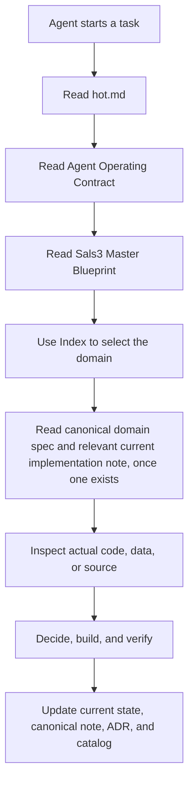

# Sals3 Second Brain Architecture

> [!IMPORTANT] Goal
> Give an agent the minimum correct context for the task while preserving a complete, searchable audit trail. Current authority must be easy to find. Historical detail must remain available without overriding current decisions.

## 1. Knowledge architecture

## 2. Context loading rule

### Always read for material Sals3 work

1. [[hot]]
2. [[agent-operating-contract]]
3. [[sals3-master-blueprint]]

### Read on demand

- Domain-specific canonical specs, once they exist, selected via [[index]].
- Historical session notes, only when researching a specific past decision or bug.
- [[parked-ideas-backlog]], when a request resembles a previously parked idea.

## 3. Why this order

Loading the whole vault for every small task wastes context and risks acting on stale information. `hot.md` is deliberately the smallest, most current file and is updated every material session. The blueprint and domain specs are larger and change less often. Historical session notes are the largest category and are searched, not preloaded.

## 4. Growth rule

As Sals3 work produces real session notes and domain specs, add them to [[index]] and [[vault-catalog]] in the same task that creates them, and keep this note's "always read" list limited to what genuinely governs every task — do not let it grow into "read everything."
