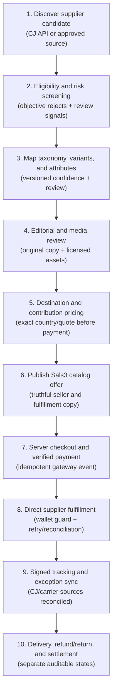
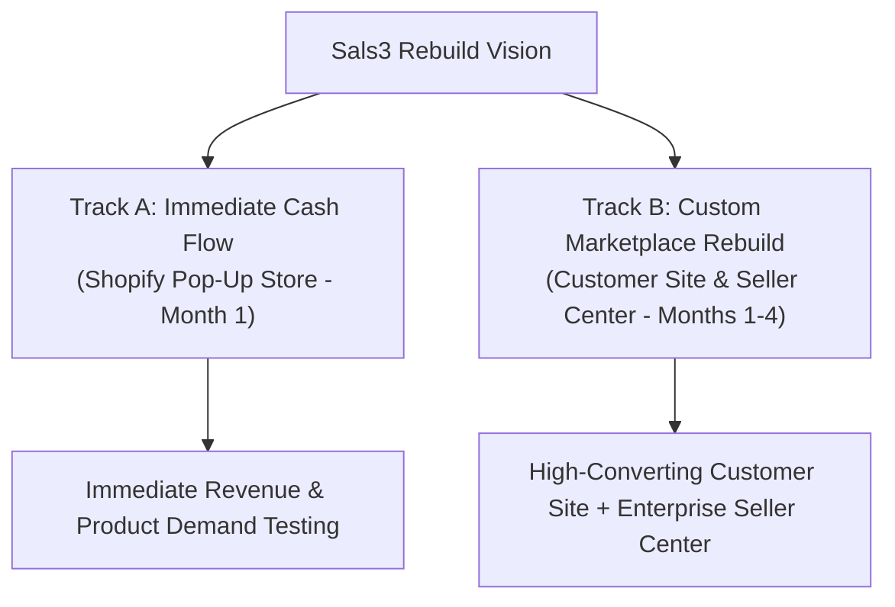
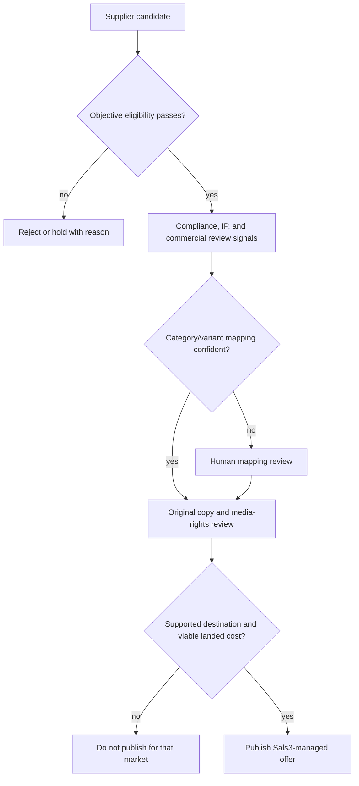

# Sals3 — End-to-End Process Flow

## Purpose

This is the canonical high-level flow for Sals3's item lifecycle, from supplier ingestion to financial settlement. Planned nodes are not implementation claims — use [[sals3-implementation-phases]] for exact completion status.

This Markdown note is the only canonical flowchart copy. Obsidian renders the Mermaid blocks directly; no external diagram tool is required.

## Mandatory maintenance rule

Update this note in the same task whenever a verified Sals3 workflow, guardrail, or system boundary changes. Do not let it drift from [[sals3-management-bible]] or [[sals3-implementation-phases]].

## Approved high-level item lifecycle

## Dual-track strategy (how Pillar 1 relates to Pillars 2/3)

## Curated catalog pipeline (quality gate)

## Full source

Current governing detail lives in ADR-001 through ADR-005 and [[sals3-ux-build-specification]]. Blueprint thresholds remain historical/sample material unless an approved ADR promotes them. This note stays intentionally shorter — a navigable map, not a duplicate specification.
