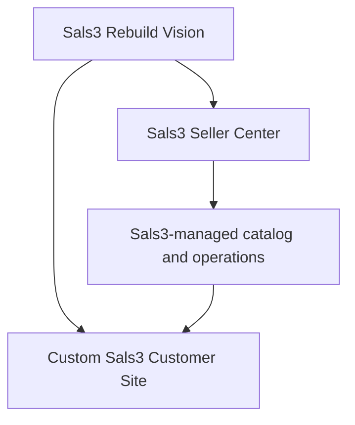
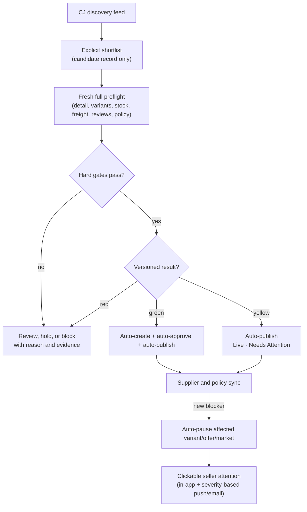

# Sals3 — End-to-End Process Flow

## Purpose

This is the canonical high-level flow for Sals3's item lifecycle, from supplier ingestion to financial settlement. Planned nodes are not implementation claims — use [[sals3-implementation-phases]] for exact completion status.

This Markdown note is the only canonical flowchart copy. Obsidian renders the Mermaid blocks directly; no external diagram tool is required.

## Mandatory maintenance rule

Update this note in the same task whenever a verified Sals3 workflow, guardrail, or system boundary changes. Do not let it drift from [[sals3-management-bible]] or [[sals3-implementation-phases]].

## Approved high-level item lifecycle

```mermaid
graph TD
    Account["Separate Dropshipper registration<br/>(immutable account business model)"] --> Connect["Connect an approved supplier<br/>(healthy tenant-owned connection)"]
    Connect --> Step1["1. Discover supplier candidate<br/>(CJ API or approved source)"]
    Step1 --> Step2["2. Automated eligibility and risk screening<br/>(hard blockers + attention signals)"]
    Step2 --> Step3["3. Map taxonomy, variants, and attributes<br/>(versioned confidence + exceptions)"]
    Step3 --> Step4["4. Validate controlled copy and media<br/>(truthful content + rights-known assets)"]
    Step4 --> Step5["5. Destination and contribution pricing<br/>(exact country/quote before payment)"]
    Step5 --> Step6["6. Auto-publish eligible Sals3 offer<br/>(attention or auto-pause on exceptions)"]
    Step6 --> Step7["7. Server checkout and verified payment<br/>(idempotent gateway event)"]
    Step7 --> Lock["Immutable ordered-item snapshot<br/>(revision, variant, price, media, supplier binding)"]
    Lock --> Step8["8. Direct supplier fulfillment<br/>(wallet guard + retry/reconciliation)"]
    Step8 --> Step9["9. Signed tracking and exception sync<br/>(CJ/carrier sources reconciled)"]
    Step9 --> Step10["10. Delivery, refund/return, and settlement<br/>(separate auditable states)"]
```

## Active platform strategy

The earlier Shopify pop-up track is rejected as an active implementation path. Preserve it only in historical/sample notes; do not build, integrate, or plan migration around Shopify.

## Curated catalog pipeline (quality gate)

The exact CJ-listing-to-editor handoff, status surfaces, field ownership, synchronization, attention, and publish gates are defined in [[cj-candidate-to-sals3-product-draft-implementation-spec]]. [[ADR-006-separate-retailer-dropshipper-registration-and-supplier-connections]] governs the prerequisite: a separately registered Dropshipper account must own a healthy approved supplier connection. Aj's existing work is named **CJ Candidate Explorer** and becomes the CJ provider adapter's discovery surface. Browsing creates no catalog record. Only an explicitly selected candidate with a fresh `PASS` or `PASS_WITH_ATTENTION` preflight may import; phase 1 has no batch import. Green auto-publishes, yellow auto-publishes with attention, and red blocks or auto-pauses. Country eligibility, permits, and counterfeit/IP evidence remain separate from freight availability. The customer storefront reads only the Sals3 published record.

[[ADR-007-supplier-change-attention-and-immutable-order-snapshots]] governs changes after publication and purchase. Supplier delist, stock loss, price spike, freight loss, or source edits protect future checkout and open actionable seller attention. An accepted order remains active and renders its immutable ordered-item/media snapshot; later product changes never rewrite it. Existing fulfillment continues through its exact committed supplier binding unless the order enters an explicit exception.

[[ADR-010-catalog-decision-governance-and-shadow-enforcement]] governs how a candidate decision becomes an action. Yellow auto-publication is limited to non-blocking quality or operational warnings. Unresolved legal, IP, safety, permit, mapping, media-rights, evidence, or near-duplicate uncertainty stops at pre-publication `REVIEW`; objective red blockers do not publish or auto-pause an affected live offer. New automatic publish/block/pause rules require a versioned golden pilot set, shadow measurement, owner-approved promotion gates, and a bounded canary. Perceptual similarity creates a reviewable duplicate cluster, never an automatic merge or rejection.

[[ADR-008-installable-supplier-apps-commission-and-seller-funded-orders]] separates installable provider access and money movement. A Dropshipper connects and funds its own CJ/approved-provider account. The Sals3 customer-payment rail records commission and seller payable; the supplier rail charges the seller's own provider wallet/payment method. No ready funding path blocks new automatic-fulfillment checkout, while an accepted order remains active in `AWAITING_SUPPLIER_FUNDS` with actionable recovery.

## Full source

Current governing detail lives in ADR-001 through ADR-005 and [[sals3-ux-build-specification]]. Blueprint thresholds remain historical/sample material unless an approved ADR promotes them. This note stays intentionally shorter — a navigable map, not a duplicate specification.
