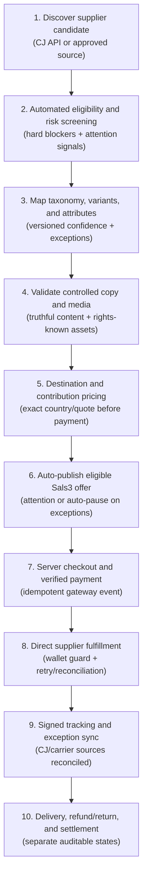
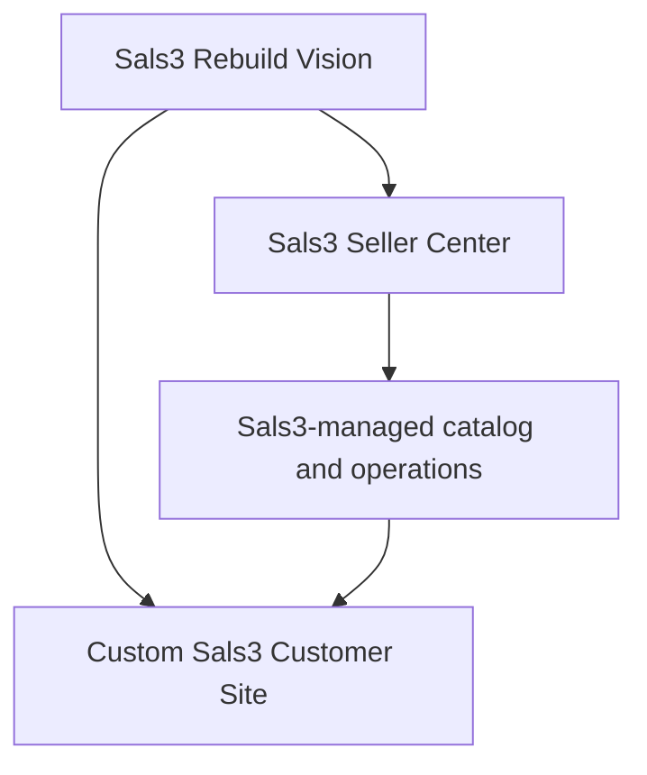
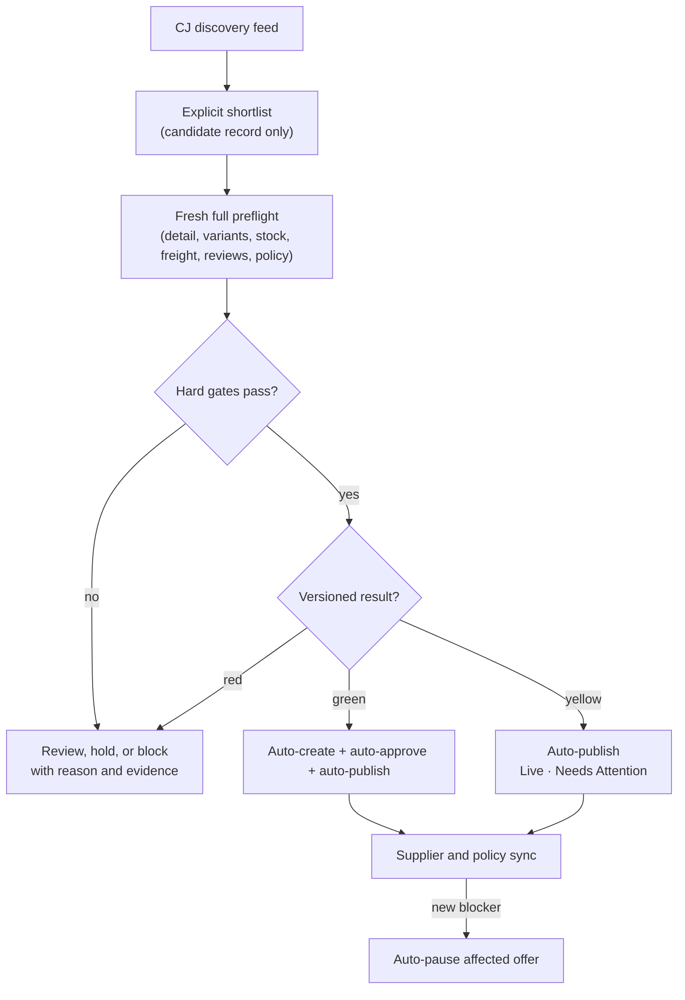

# Sals3 — End-to-End Process Flow

## Purpose

This is the canonical high-level flow for Sals3's item lifecycle, from supplier ingestion to financial settlement. Planned nodes are not implementation claims — use [[sals3-implementation-phases]] for exact completion status.

This Markdown note is the only canonical flowchart copy. Obsidian renders the Mermaid blocks directly; no external diagram tool is required.

## Mandatory maintenance rule

Update this note in the same task whenever a verified Sals3 workflow, guardrail, or system boundary changes. Do not let it drift from [[sals3-management-bible]] or [[sals3-implementation-phases]].

## Approved high-level item lifecycle

## Active platform strategy

The earlier Shopify pop-up track is rejected as an active implementation path. Preserve it only in historical/sample notes; do not build, integrate, or plan migration around Shopify.

## Curated catalog pipeline (quality gate)

The exact CJ-listing-to-editor handoff, status surfaces, field ownership, synchronization, attention, and publish gates are defined in [[cj-candidate-to-sals3-product-draft-implementation-spec]]. Aj's existing work is named **CJ Candidate Explorer** and remains the read-only discovery source. Browsing creates no catalog record. Only an explicitly selected candidate with a fresh `PASS` or `PASS_WITH_ATTENTION` preflight may import; phase 1 has no batch import. Green auto-publishes, yellow auto-publishes with attention, and red blocks or auto-pauses. Country eligibility, permits, and counterfeit/IP evidence remain separate from CJ freight availability. The customer storefront reads only the Sals3 published record.

## Full source

Current governing detail lives in ADR-001 through ADR-005 and [[sals3-ux-build-specification]]. Blueprint thresholds remain historical/sample material unless an approved ADR promotes them. This note stays intentionally shorter — a navigable map, not a duplicate specification.
