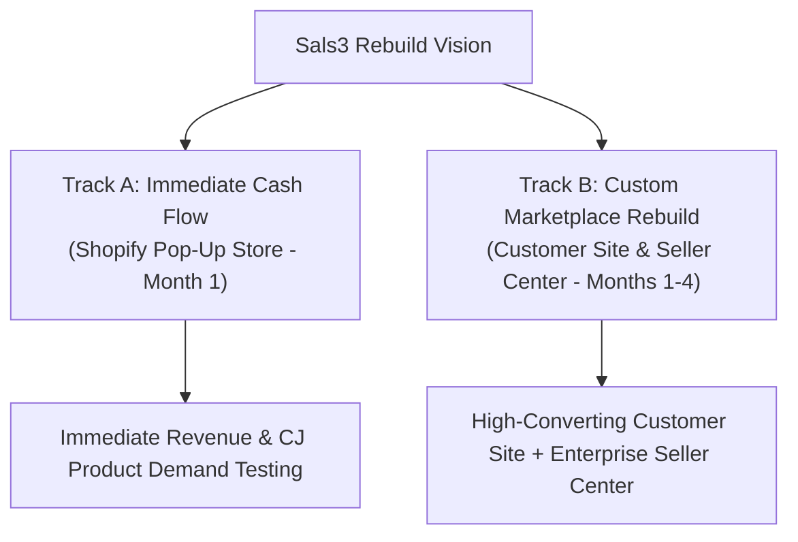
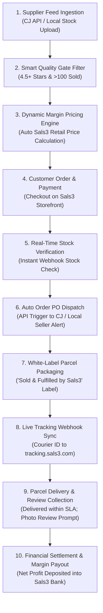
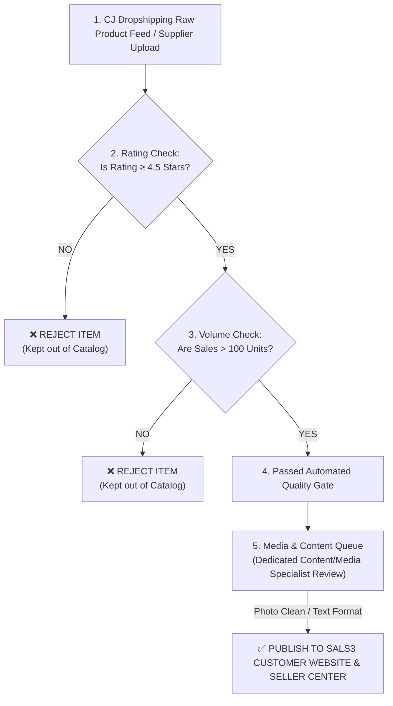
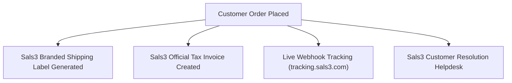

> [!NOTE] Provenance
> Authored by AJ & Bogs prior to this vault's creation; moved here from the shared BOGS Dashboard vault on 2026-07-31 without content changes. `status: sample` and `owner_approved: false` reflect this document's own governance disclaimer (see below) — treat it as strategic vision pending Sals3 Leadership alignment, not an approved build contract. Source UI mockups and the presentation deck live in `Raw/`.

# Sals3 Next-Generation Hybrid Marketplace
## Super-Detailed Master System Architecture, Commercial Strategy & Transition Blueprint

**Document Version:** 4.0 (Master Release)  
**Lead Systems Architects & Operators:** AJ & Louienell "Bogs" Gonzales (The Sals3 Engineering & Operations Team)  
**Target Enterprise Platform:** Sals3 (`sals3.com`)  
**Target Audience:** Sals3 Owner, Board of Directors, Tech & Operations Executive Panel  

---

> [!IMPORTANT]
> **GOVERNANCE & ALIGNMENT DISCLAIMER**  
> All UI mockups, visual layout diagrams, payment gateway samples (GCash, Maya, Credit Cards, PayPal), commission calculations, and operational workflows presented in this master document serve as **sample visual & structural representations for demonstration purposes**. All exact business logic rules, payment partner integrations, platform fee structures, and feature workflows will undergo **further detailed alignment discussions with Sals3 Leadership** prior to final technical execution.

---

# TABLE OF CONTENTS
1. [Executive Summary & Strategic Transformation Vision](#1-executive-summary--strategic-transformation-vision)
2. [The 3 Core Pillars of Sals3 Architecture](#2-the-3-core-pillars-of-sals3-architecture)
   - [Pillar 1: Temporary Shopify Pop-Up Store (Month 1 Cash Flow Engine)](#pillar-1-temporary-shopify-pop-up-store-month-1-cash-flow-engine)
   - [Pillar 2: Custom B2C Customer Shopping Website (Months 1–4 Build)](#pillar-2-custom-b2c-customer-shopping-website-months-14-build)
   - [Pillar 3: Custom Sals3 Enterprise Seller Center (Months 1–4 Build)](#pillar-3-custom-sals3-enterprise-seller-center-months-14-build)
3. [System Operational Flowchart & 10-Step Item Lifecycle](#3-system-operational-flowchart--10-step-item-lifecycle)
4. [Curated High-Quality Catalog Pipeline & Media Review Queue](#4-curated-high-quality-catalog-pipeline--media-review-queue)
5. [Deep Specification: Pillar 2 Customer Shopping Website (Where Buyers Shop)](#5-deep-specification-pillar-2-customer-shopping-website-where-buyers-shop)
6. [Deep Specification: Pillar 3 Enterprise Seller Center (Where Sellers Work)](#6-deep-specification-pillar-3-enterprise-seller-center-where-sellers-work)
   - [Module 1: Main Seller Center Dashboard](#module-1-main-seller-center-dashboard)
   - [Module 2: Order Management & Auto-PO Fulfillment](#module-2-order-management--auto-po-fulfillment)
   - [Module 3: Product Management & Bulk SKU Upload](#module-3-product-management--bulk-sku-upload)
   - [Module 4: Finance & Net Margin Payout Ledger](#module-4-finance--net-margin-payout-ledger)
7. [3 to 4-Month Development, QA & Data Migration Timeline](#7-3-to-4-month-development-qa--data-migration-timeline)
8. [White-Label Branding & Customer Trust Protocol](#8-white-label-branding--customer-trust-protocol)

---

# 1. Executive Summary & Strategic Transformation Vision

The current operating model of Sals3 relies on raw API ingestion from CJ Dropshipping directly into the storefront. While this provides vast catalog breadth, it creates critical operational bottlenecks:
1. **Catalog Pollution:** Unfiltered API feeds import low-rated items, broken variations, machine-translated titles, and watermarked supplier photos.
2. **Stock & Margin Drift:** Supplier stockouts or shipping price increases lead to overselling or margin erosion.
3. **Brand Fragmentation:** Customers receive packages with external supplier logos, reducing repeat purchase trust.

### The Transformation Strategy (The Dual-Track Approach)
Our team (AJ & Bogs) will execute a **Dual-Track Strategy** designed to achieve **immediate commercial revenue in Month 1** while building a **custom Shopee/Lazada-style marketplace architecture over 3 to 4 months**:



---

# 2. The 3 Core Pillars of Sals3 Architecture

To make the platform architecture crystal-clear for business owners and non-technical stakeholders, we divide Sals3 into **3 Core Operational Pillars**:

```
                               ┌──────────────────────────────────────────────┐
                               │ SALS3 MASTER E-COMMERCE SYSTEM ARCHITECTURE │
                               └──────────────────────┬───────────────────────┘
                                                      │
                       ┌──────────────────────────────┴──────────────────────────────┐
                       ▼                                                             ▼
┌──────────────────────────────────────────────┐              ┌──────────────────────────────────────────────┐
│  🛍️ PILLAR 2: CUSTOMER SHOPPING WEBSITE      │              │  ⚙️ PILLAR 3: SALS3 SELLER CENTER            │
│  (WHERE BUYERS SHOP - sals3.com)             │              │  (WHERE SELLERS WORK)                        │
│                                              │              │                                              │
│  • Public shopping marketplace (Shopee/      │              │  • Private seller & supplier control panel   │
│    Lazada style storefront).                 │              │    (Shopee Seller Centre style).             │
│  • Buyers browse items, add to cart, pay     │              │  • Sellers upload SKUs, process orders,      │
│    via GCash/Cards, & track parcels live.    │              │    print waybills, & claim net earnings.     │
└──────────────────────────────────────────────┘              └──────────────────────────────────────────────┘

                                                      ▲
                                                      │
                               ┌──────────────────────┴───────────────────────┐
                               │  🏬 PILLAR 1: SHOPIFY POP-UP STORE (MONTH 1) │
                               │  (Interim Cash Flow Engine)                  │
                               │                                              │
                               │  • Temporary storefront running during       │
                               │    Month 1 to maintain active sales while    │
                               │    the custom platform is developed.         │
                               └──────────────────────────────────────────────┘
```

### Pillar 1: Temporary Shopify Pop-Up Store (Month 1 Cash Flow Engine)
* **Duration:** Month 1 (Active for 30 Days).
* **Objective:** Keep sales flowing immediately, test product demand, generate daily cash flow, and validate marketing campaigns.
* **Execution:** Quick deployment of a clean Shopify theme (*Dawn Theme*), manual/semi-automated application of Bogs' **Smart Quality Filter**, integration of local payment gateways, and background logging of all customer and order records for future migration.

### Pillar 2: Custom B2C Customer Shopping Website (Months 1–4 Build)
* **Duration:** Months 1 – 4 (3 to 4-Month Custom Development).
* **Objective:** Deliver a high-converting, mobile-optimized shopping website (`sals3.com`) modeled after top Asian marketplaces (Shopee and Lazada).
* **Execution:** Curated product catalogs, high-res photo galleries, verified customer reviews, mobile 1-click checkout, dynamic shipping calculators, real-time inventory locks, and white-label tracking portals (`tracking.sals3.com`).

### Pillar 3: Custom Sals3 Enterprise Seller Center (Months 1–4 Build)
* **Duration:** Months 1 – 4 (3 to 4-Month Custom Development).
* **Objective:** Provide a powerful operating portal for dropshippers, CJ suppliers, and direct local brand sellers.
* **Execution:** 4 core operating modules: Main Seller Dashboard, Order Management & Auto-PO Dispatch, Product Management & Bulk SKU Upload Workbooks, and Finance & Net Margin Payout Ledgers.

---

# 3. System Operational Flowchart & 10-Step Item Lifecycle

This detailed flowchart illustrates the end-to-end operational path of an item—from supplier ingestion to final customer delivery and profit settlement:



### Detailed Narrative of the 10 Steps:
1. **Step 1: Supplier Feed Ingestion:** Raw item feeds are fetched via CJ Dropshipping API or uploaded by local brand sellers holding warehouse stock.
2. **Step 2: Smart Quality Gate Filtration:** Algorithmic rules verify if the product has **$\ge 4.5$ Stars rating**, **$>100+$ units sold**, and comes from a **Verified Gold Supplier**.
3. **Step 3: Dynamic Margin Pricing Engine:** System calculates Sals3 listing price:
   $$\text{Sals3 Price} = (\text{Supplier Cost} + \text{Shipping}) \times (1 + \text{Margin \%}) + \text{Buffer}$$
4. **Step 4: Customer Order & Payment Collection:** Customer buys the item on Sals3 storefront. Payment (GCash, Maya, Card, PayPal) is collected and net profit margin is locked in the ledger.
5. **Step 5: Real-Time Stock Verification:** System verifies live supplier inventory via API/Webhook before finalizing the transaction.
6. **Step 6: Automated Supplier Order Dispatch:** System auto-generates a purchase order via API to CJ Dropshipping or sends dispatch alerts to the local seller's portal.
7. **Step 7: White-Label Packaging:** Item is packed with **"Sold & Fulfilled by Sals3"** branded shipping labels, receipts, and customer support details.
8. **Step 8: Live Tracking Webhook Sync:** Tracking numbers are pushed to `tracking.sals3.com` with automated SMS/email milestone alerts (*"In Transit"*, *"Out for Delivery"*).
9. **Step 9: Customer Parcel Delivery & Review Prompt:** Item delivered within courier SLA. Automated email trigger (7 days post-delivery) prompts customer to submit photo reviews.
10. **Step 10: Financial Reconciliation & Profit Deposit:** Final ledger settlement reconciles buyer payment vs. supplier cost vs. net profit deposited into Sals3 bank accounts.

---

# 4. Curated High-Quality Catalog Pipeline & Media Review Queue

To prevent low-quality "junk" listings from polluting the storefront, all incoming products pass through a multi-stage approval pipeline:



> [!NOTE]
> **MEDIA & PHOTO TOUCHUPS WORKFLOW (ADDITIONAL FEATURE)**  
> Technical development of the core platform by AJ & Bogs does **not** include manual photo editing or graphic design. Photo cleanup, watermark removal, banner design, and custom image formatting will be handled as an **Additional Feature / Separate Workflow** assigned to a dedicated Content/Media Specialist (details to be finalized in a separate discussion).

---

# 5. Deep Specification: Pillar 2 Customer Shopping Website (Where Buyers Shop)

Modeled after **Lazada & Shopee B2C Marketplace Websites**, the Sals3 Customer Shopping Storefront delivers a frictionless, high-converting purchasing experience.

```
┌─────────────────────────────────────────────────────────────────────────────────────────┐
│ SALS3 CUSTOMER SHOPPING STOREFRONT UI (PLAIN WHITE SHOPEE-STYLE MOCKUP)                 │
├──────────────────────────────────────────┬──────────────────────────────────────────────┤
│ 🛍️ WHAT HAPPENS ON THIS SCREEN:           │                                              │
│                                          │                                              │
│ • Public Storefront (sals3.com):         │   [ PLAIN WHITE SHOPEE-STYLE UI MOCKUP ]     │
│   Main shopping site for buyers.         │                                              │
│ • Shopee/Lazada Style UX:                │   • Header search bar & categories           │
│   Categories, banners, & product grid.   │   • Banner promo carousel                    │
│ • Only High-Quality Items:               │   • Product cards grid with ratings          │
│   Passes 4.5+ Star & >100 Sales filter.  │     and Add to Cart buttons                  │
│ • Real-Time Stock Lock:                  │                                              │
│   Out-of-stock items hide automatically. │                                              │
│ • Mobile & Desktop Optimized:            │                                              │
│   Built for high conversion rates.       │                                              │
└──────────────────────────────────────────┴──────────────────────────────────────────────┘
```

### Core Customer Features:
1. **Curated Storefront Catalog:** Displays only high-performing products passing our Smart Quality Gate.
2. **Rich Product Detail Pages:** High-resolution photo galleries, variation selectors (Color, Size, Spec), verified customer photo reviews, and Q&A section.
3. **1-Click Checkout Engine:** Fast checkout supporting sample payment methods (GCash, Maya, Credit/Debit Cards, PayPal, Cash on Delivery). *(Note: Payment partners subject to final business alignment).*
4. **Dynamic Shipping & Tax Calculator:** Real-time shipping fee calculation based on buyer delivery address and automated BIR tax invoice logging.
5. **Real-Time Stock Guard:** Out-of-stock variations are automatically disabled in real time to eliminate overselling disputes.

---

# 6. Deep Specification: Pillar 3 Enterprise Seller Center (Where Sellers Work)

Modeled after **Shopee Seller Centre, Lazada Seller Center, and TikTok Shop Seller Center**, the Sals3 Seller Center provides a clean, plain white corporate operating portal for sellers and suppliers.

---

## Module 1: Main Seller Center Dashboard

```
┌─────────────────────────────────────────────────────────────────────────────────────────┐
│ MODULE 1: MAIN SELLER CENTER DASHBOARD (PLAIN WHITE MOCKUP)                             │
├──────────────────────────────────────────┬──────────────────────────────────────────────┤
│ ⚙️ WHAT HAPPENS ON THIS SCREEN:           │                                              │
│                                          │   [ PLAIN WHITE DASHBOARD UI MOCKUP ]        │
│ • Seller Command Center:                 │                                              │
│   Private portal for dropshippers &      │   • Top KPI Bar: To-Process, Shipped, Returns│
│   local brand sellers.                   │   • Business Insights: Sales GMV & Visitors  │
│ • Top Action KPI Bar:                    │   • Conversion Rate % & Net Profit Margin    │
│   Real-time counters for To-Process,     │   • Shop Health Score & Announcements        │
│   Processed Shipments, & Returns.        │                                              │
│ • Business Insights:                     │                                              │
│   Live sales analytics (GMV), traffic,   │                                              │
│   conversion %, & net profit.            │                                              │
└──────────────────────────────────────────┴──────────────────────────────────────────────┘
```

### Functional Highlights:
* **Top KPI Action Bar:** Instant operational visibility into `To-Process Shipments`, `Processed Shipments`, `Return/Refund/Cancel Requests`, and `Active Products`.
* **Business Insights Panel:** Real-time tracking of Gross Merchandise Value (GMV ₱), unique visitor count, product clicks, completed orders, order conversion rate %, and net profit margins.
* **Shop Health Audit Panel:** Real-time scoring of seller fulfillment speed, cancellation rates, buyer chat response time, and customer ratings.

---

## Module 2: Order Management & Auto-PO Fulfillment

```
┌─────────────────────────────────────────────────────────────────────────────────────────┐
│ MODULE 2: ORDER MANAGEMENT & AUTO-FULFILLMENT (PLAIN WHITE MOCKUP)                       │
├──────────────────────────────────────────┬──────────────────────────────────────────────┤
│ 📦 WHAT HAPPENS ON THIS SCREEN:           │                                              │
│                                          │   [ PLAIN WHITE ORDER UI MOCKUP ]            │
│ • Order Lifecycle Tracking:              │                                              │
│   Status tabs (UNPAID -> TO-SHIP ->      │   • Order Status Tabs Filter                 │
│   SHIPPED -> COMPLETED).                 │   • Order List Table with Buyer Details      │
│ • 1-Click Mass Waybills:                 │   • Print Packing Slip Button                │
│   Prints official 'Sold by Sals3' labels.│   • Dispatch to CJ API Auto-PO Button        │
│ • Auto CJ API PO Trigger:                │                                              │
│   Automatically orders item from CJ API. │                                              │
└──────────────────────────────────────────┴──────────────────────────────────────────────┘
```

### Functional Highlights:
* **Order Status Lifecycle:** Centralized tracking across status buckets: `UNPAID` $\rightarrow$ `PAID` $\rightarrow$ `PROCESSING` $\rightarrow$ `SHIPPED` $\rightarrow$ `DELIVERED` $\rightarrow$ `COMPLETED`.
* **1-Click Mass Ship:** Batch printing of official **"Sold & Fulfilled by Sals3"** shipping waybills, packing slips, and tax receipts.
* **Automated Dispatch Trigger:** One-click API dispatch automatically generates purchase orders to CJ Dropshipping or alerts local warehouse fulfillment teams.

---

## Module 3: Product Management & Bulk SKU Upload

```
┌─────────────────────────────────────────────────────────────────────────────────────────┐
│ MODULE 3: PRODUCT MANAGEMENT & BULK SKU UPLOAD (PLAIN WHITE MOCKUP)                     │
├──────────────────────────────────────────┬──────────────────────────────────────────────┤
│ 📝 WHAT HAPPENS ON THIS SCREEN:           │                                              │
│                                          │   [ PLAIN WHITE PRODUCT UI MOCKUP ]          │
│ • Catalog Grid View:                     │                                              │
│   Manage published products, prices,     │   • Product Thumbnails & Titles Table        │
│   stock levels, & ratings.               │   • Bulk SKU Excel Upload Workbook Button    │
│ • Bulk SKU Excel Import:                 │   • Add New Product & Variation Matrix       │
│   Upload thousands of local SKUs.        │   • Rating Badges & Published Toggle         │
│ • Multi-Variation Matrix:                │                                              │
│   Configure size, color, weight, & price.│                                              │
└──────────────────────────────────────────┴──────────────────────────────────────────────┘
```

### Functional Highlights:
* **Product Catalog Grid:** Real-time management of active SKUs, inventory counts, retail prices, and Quality Gate score badges.
* **Bulk SKU Excel Import:** Supports direct Excel/CSV workbook uploads for local brand stock sellers holding warehouse inventory.
* **Multi-Variation Matrix:** Support for complex variations (Size, Color, Weight, Fabric, Spec) with individual SKU stock and price mapping.

---

## Module 4: Finance & Net Margin Payout Ledger

```
┌─────────────────────────────────────────────────────────────────────────────────────────┐
│ MODULE 4: FINANCE & NET MARGIN PAYOUT LEDGER (PLAIN WHITE MOCKUP)                       │
├──────────────────────────────────────────┬──────────────────────────────────────────────┤
│ 💰 WHAT HAPPENS ON THIS SCREEN:           │                                              │
│                                          │   [ PLAIN WHITE FINANCE UI MOCKUP ]          │
│ • Dynamic Profit Ledger:                 │                                              │
│   Net Payout = Selling Price - Cost -    │   • Available Payout Balance Card ₱          │
│   Logistics Fee - Sals3 Fee.             │   • Margin Breakdown Calculator Card         │
│ • Automated Bank Withdrawal:             │   • Withdraw to Bank Account Button          │
│   Secure payouts to seller banks.        │   • BIR EOPT Tax Invoice Log                 │
│ • Full Audit Transparency:               │                                              │
│   Detailed financial breakdown per order.│                                              │
└──────────────────────────────────────────┴──────────────────────────────────────────────┘
```

### Functional Highlights:
* **Dynamic Margin Ledger:** Automatically calculates net seller earnings for every completed transaction:
  $$\text{Net Payout} = \text{Selling Price} - \text{Supplier Item Cost} - \text{Logistics Fee} - \text{Sals3 Platform Fee}$$
* **Automated Withdrawal Engine:** Secure payout transfers directly to registered seller bank accounts or e-wallets.
* **BIR Tax Compliance (EOPT):** Automated generation of official transaction receipts and tax withholding summaries.

---

# 7. 3 to 4-Month Development, QA & Data Migration Timeline

```gantt
    title Sals3 3 to 4-Month Transition Roadmap
    dateFormat  YYYY-MM-DD
    section Month 1: Shopify & Setup
    Shopify Pop-Up Store Launch (Live Revenue) :m1, 2026-08-03, 30d
    Database Schema & Quality Gate Build      :m1_b, 2026-08-03, 30d
    section Months 2 - 3: Core Development
    Custom B2C Website Development            :m2, 2026-09-01, 60d
    Custom Seller Center Development          :m3, 2026-09-01, 60d
    section Month 4: QA & Cutover
    System Integration & Load Testing         :m4, 2026-11-01, 15d
    Shopify Data Migration & DNS Cutover      :m5, after m4, 15d
```

### Execution Phases:
* **Month 1 (Shopify Cash Flow Bridge):** We launch the temporary Shopify Storefront to generate immediate cash flow. In parallel, we establish Git repositories, CI/CD pipelines, and database schemas.
* **Months 2 – 3 (Custom Platform Development):** We develop the custom B2C Customer Website (Shopee/Lazada style) and the Enterprise Sals3 Seller Center in parallel.
* **Month 4 (QA Audit, Data Migration & Cutover):** We conduct stress/load testing on database queries and API endpoints, migrate Shopify customer CSV records and top-selling SKUs, and execute a zero-downtime DNS cutover to `sals3.com`!

---

# 8. White-Label Branding & Customer Trust Protocol

To build 100% customer trust and repeat purchase loyalty, all customer touchpoints are standardized under the Sals3 brand identity:



1. **Packaging & Labels:** All shipping boxes and polymailers bear **"Sold & Fulfilled by Sals3"** shipping labels.
2. **Invoices & Receipts:** Customers receive standardized Sals3 e-receipts and BIR-compliant tax invoices.
3. **Live Tracking Portal:** Orders are tracked via a branded tracking URL (`tracking.sals3.com`) with automated SMS/email milestone alerts.
4. **Centralized Support:** All returns, inquiries, and disputes are handled through the Sals3 customer resolution desk.

---

> [!NOTE]
> **FINAL ALIGNMENT REMINDER**  
> This master document outlines the technical framework and strategic vision designed by AJ & Bogs. All specific business rules, platform commission rates, payment gateway partnerships, and category structures remain open for **further detailed alignment discussions with Sals3 Leadership** to ensure complete agreement prior to code deployment.
