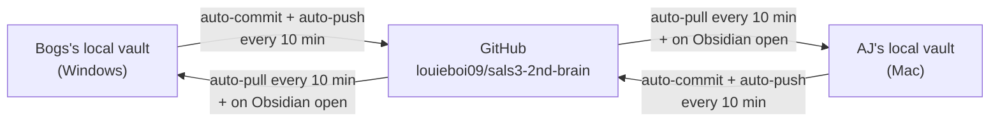

# Vault Sync Setup Guide

> [!IMPORTANT] What this is
> How to get this vault onto a new machine so it stays in sync automatically with everyone else on the team. Written for AJ (Mac) joining Bogs's existing setup (Windows), but the steps work for any new machine either of them uses later.

## How the sync actually works

There is **no cloud-hosted Obsidian**. Obsidian is a local app that reads a folder on disk — that is its architecture, and no plugin changes it. What we use instead:

- Each person keeps a **local clone** of the vault's GitHub repo.
- The **Obsidian Git** plugin (`obsidian-git`, by Vinzent) runs inside Obsidian and does the git work automatically in the background.
- GitHub is the shared middle point. Nobody types a git command.



### Current settings (already committed in the repo — you inherit them, don't re-enter them)

`.obsidian/plugins/obsidian-git/data.json`:

| Setting | Value | Meaning |
|---|---|---|
| `autoPullOnBoot` | `true` | Pull the latest as soon as Obsidian opens. |
| `autoSaveInterval` | `10` | Auto-commit your changes every 10 minutes. |
| `autoPushInterval` | `10` | Push commits to GitHub every 10 minutes. |
| `autoPullInterval` | `10` | Pull others' changes every 10 minutes. |

### Honest limitations — know these before relying on it

1. **Not instant.** Worst case, a change can take up to ~30 minutes to appear on the other machine (10 min to commit + 10 min to push + 10 min for the other side to pull). Usually faster, since the timers aren't aligned.
2. **Obsidian must be running.** The timers only run while Obsidian is open (minimized is fine). If it's closed, nothing syncs until it's opened again — at which point auto-pull-on-boot catches up.
3. **Same-file simultaneous edits cause a merge conflict.** Obsidian is not Google Docs; there is no real-time co-editing. If two people edit the *same file* before a sync completes, git will need a manual conflict resolution. Rare in practice with a 10-minute cycle, but not impossible — coordinate before both editing e.g. `hot.md` at the same time.
4. **`workspace.json` is deliberately gitignored** — that file holds which panes/tabs you have open, which is per-person, not shared. Don't remove it from `.gitignore`.

## Setup steps for a new machine

### 1. Get repository access

The repo is **private**: `github.com/louieboi09/sals3-2nd-brain`.

Bogs must add the new person as a collaborator first: repo → **Settings → Collaborators → Add people**. Without this, the clone will fail with a permissions error, not an obvious "you're not invited" message.

### 2. Install git (Mac)

```bash
git --version
```

If it prompts to install the Xcode Command Line Tools, accept. Otherwise:

```bash
xcode-select --install
```

Homebrew (`brew install git`) also works if preferred.

### 3. Authenticate with GitHub

Easiest path — GitHub CLI:

```bash
brew install gh
gh auth login
```

Choose **GitHub.com → HTTPS → Login with a web browser**, and let it configure git credentials when it offers. This stores the credential so the Obsidian Git plugin can push without prompting.

### 4. Clone the vault

```bash
git clone https://github.com/louieboi09/sals3-2nd-brain.git "$HOME/SALS3 2nd brain"
```

Any folder location works — the path does not need to match Bogs's `E:\SALS3 2nd brain`.

### 5. Open it in Obsidian

Obsidian → **Open folder as vault** → select the cloned folder.

On first open it will ask: *"Do you trust the author of this vault?"* → choose **Trust author and enable plugins**. The only plugin in this vault is Obsidian Git, and it came from the official release at `github.com/Vinzent03/obsidian-git`.

### 6. Verify it's actually linked

- The left ribbon shows a **git icon**; the status bar (bottom right) shows the sync state.
- Run the command palette (`Cmd+P`) → **"Git: Pull"** once. It should say *"Everything is up-to-date"* rather than an error.
- Make a trivial edit in any note, wait ~10 minutes, and confirm a new `vault backup: <timestamp>` commit appears on GitHub.

Do not re-enter the interval settings — they arrive with the clone (step 4) via the committed `data.json`.

## Troubleshooting

| Symptom | Likely cause |
|---|---|
| Clone fails with auth/permission error | Not yet added as a collaborator (step 1), or `gh auth login` not completed (step 3). |
| Plugin appears but does nothing | Community plugins still in Restricted Mode — re-open the vault and choose "Trust author and enable plugins." |
| Push fails, "rejected / non-fast-forward" | The other person pushed first. Run **"Git: Pull"** from the command palette, resolve if prompted, then let the next auto-push run. |
| Conflict markers (`<<<<<<<`) appear inside a note | Both people edited the same file before syncing. Edit the file to keep the correct content, delete the marker lines, save. |
| Changes not appearing on the other machine | Confirm Obsidian is actually open there (limitation #2 above), and that up to ~30 minutes has genuinely passed. |
